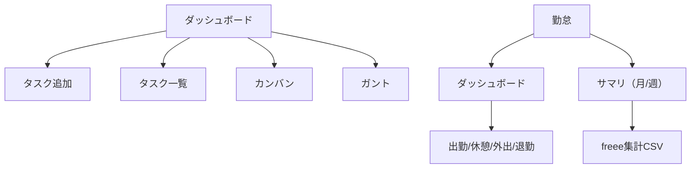

# PJバインダー マニュアル（初使用者向け）

この文書は「初めてPJバインダーを使う人」が、最低限の操作を迷わずできることを目的にしています。

## 1. これは何？
PJバインダーは、主に次を1つの画面で扱うためのツールです。

- タスク管理（一覧 / カンバン / ガント）
- プロジェクト管理（親子・期間・予算・メモ・Docs）
- 議事録・日報（Docs自動作成）
- 勤怠（出退勤・休憩/外出・予定表示・freee向けCSV）

## 2. まずは画面の見方（ページとタブ）

- 上部ナビゲーション（ページ）
  - ダッシュボード / 勤怠 / ユーザー / 議事録 / 日報 / 予算 / サブスク / 入出金 / プロジェクト など
- ダッシュボード内のタブ（タスク表示の切替）
  - タスク一覧 / カンバン / ガント

### Deep link（ブックマークに便利）
URLパラメータで直接開けます。

- `?page=attendance&view=dashboard`（勤怠ダッシュボード）
- `?page=attendance&view=summary`（勤怠サマリ）
- `?page=dashboard&tab=board`（ダッシュボード→カンバン）
- `?page=dashboard&tab=gantt`（ダッシュボード→ガント）

## 3. 最初にやること（ユーザー情報の登録）
※この項目は「管理者/運用担当」が実施することが多いです。

1. 「ユーザー」ページを開く
2. ユーザー一覧で、各ユーザーの以下を設定する
   - **freee従業員番号**（勤怠CSV出力に使用）
   - **個人カレンダー(ICS)**（勤怠ダッシュボードの予定表示に使用）
   - **勤怠に表示**（勤怠ダッシュボード/CSVに出すか）

### 3.1 個人カレンダー(ICS)の設定手順（Googleカレンダー）

勤怠ダッシュボードの「現在の予定/次の予定」は、各ユーザーのICS URLを使って表示します。

1. Googleカレンダーで、連携したいカレンダーを開く
2. **設定と共有** を開く
3. **予定のアクセス権限** で、次を有効化する
  - **一般公開して誰でも利用できるようにする**
  - **予定の表示（すべての予定の詳細）**
4. **カレンダーの統合** の **このカレンダーの公開URL** をコピーする
5. PJバインダーの **ユーザー** ページで、対象ユーザーの **ICS欄** に貼り付ける

注意：この手順はカレンダーの公開設定を伴います。公開範囲・運用ルールは組織の方針に合わせてください。

## 4. タスク管理（まずはここだけできればOK）

### 4.1 タスクを追加する
1. ダッシュボードを開く
2. 左側の入力エリアで「タスク追加」を押す
3. タイトル・期限・担当などを入れて登録

### 4.2 タスクの状態を変える（未着手→進行中→完了）
- 一覧：行の操作から
- カンバン：カードのボタン、またはドラッグ&ドロップ

状態（ステータス）の種類：
- 未着手（todo）
- 進行中（doing）
- 保留中（blocked）
- 完了（done）

### 4.3 カンバンを見る
- ダッシュボード → 「カンバン」タブ
- フィルタが上にあるので、まず「プロジェクト」だけ絞るのがおすすめ

### 4.4 ガントを見る
- ダッシュボード → 「ガント」タブ
- 期間（表示範囲）を設定し、「適用」

## 5. プロジェクト管理（基本）

- プロジェクトは「親子」を持てます
- 期間（開始/終了）と予算（任意）を持てます
- 必要に応じてDocsを作成し、リンクで開けます

## 6. Docs（Googleドキュメント）を使う

- プロジェクト / タスク / 議事録 / 日報は、ボタンからDocsを作成・参照できます
- Docs作成は「ベストエフォート」扱い（失敗しても他の保存が進む設計）

## 7. 勤怠（今日の打刻）

### 7.1 画面の開き方
- `勤怠 → ダッシュボード`

### 7.2 打刻
各ユーザーカードに操作ボタンがあります。

- 出勤(オフィス)
- 出勤(テレワーク)
- 出勤(外出)
- 休憩 / 休憩戻り
- 外出 / 外出戻り
- 退勤 / 退勤取消

### 7.3 自動更新（タブレット常時表示）
勤怠ダッシュボードには「自動更新」と「間隔」があります。

- 例：タブレットに固定表示する場合は `120s` か `300s` を推奨

## 8. よくあるつまずき

- カンバン/ガントが見えない
  - いったん「ダッシュボード」へ戻ってから、タブ（カンバン/ガント）を選んでください
- 勤怠にユーザーが出ない
  - 「ユーザー」ページで `勤怠に表示` がOFFになっていないか確認
  - `freee従業員番号` 未設定でも表示はできますが、CSVが困るので早めに設定推奨

---

## 付録：操作フロー（Mermaid）

