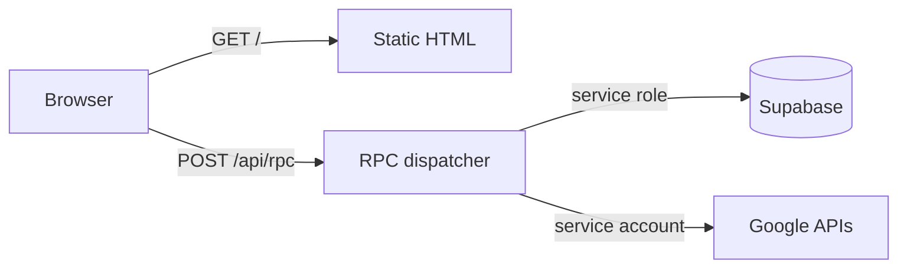
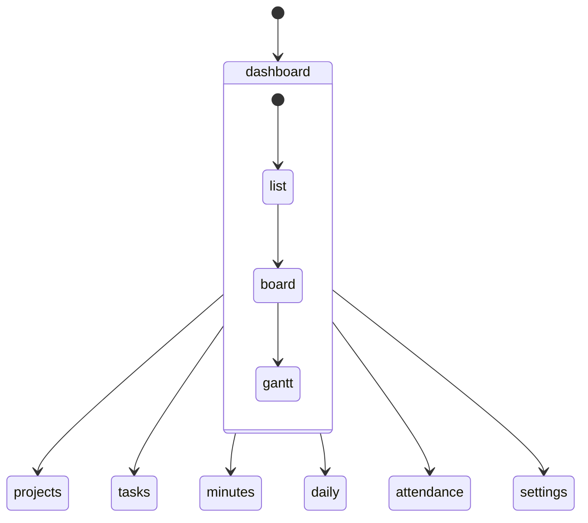
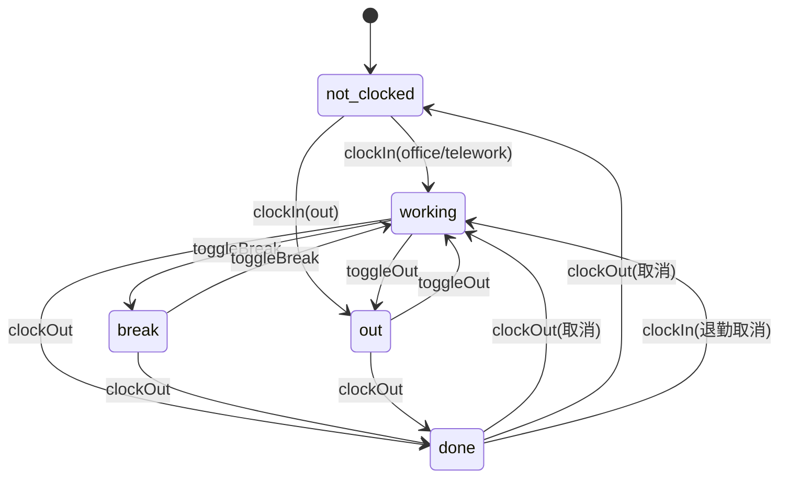

# PJバインダー 仕様書（簡易）

この文書は、運用・保守や不具合調査のための「実装寄り仕様」です。

## 1. 全体構成

- 配信：Vercel（静的配信 + API Routes）
- フロント：単一ページの `public/index.html` にUIを集約
- バックエンド：`/api/rpc` でRPCディスパッチ（必要に応じて遅延import）
- DB：Supabase（service role）
- 外部：Google Drive/Docs（service account）

## 2. 画面/ルーティング

### 2.1 画面遷移
- クエリでページ・タブを表現する
  - `?page=dashboard` など
  - ダッシュボード内部は `?tab=board|gantt|...` を併用

### 2.2 「どのページからでもカンバン/ガントへ」
- ショートカットは「ダッシュボードへ戻る」→「タブ切替」の2段が必要
- タブ切替だけでは表示DOMが存在しないページがあるため

## 3. RPC（/api/rpc）

### 3.1 呼び出し規約
- フロントは `name` と `args` を指定して `/api/rpc` にPOST
- サーバは `name` でハンドラを引き当て、`args` を関数へ渡す

### 3.2 遅延import方針
- API Route のトップレベル import を増やすと Vercel の実行環境で失敗しうる
- そのため、RPCごとに実装モジュールを遅延ロードし、必要な時だけ読み込む

### 3.3 代表的なRPC
- タスク
  - `setTaskStatus`：タスクのステータス更新（todo/doing/blocked/done）
- 勤怠
  - `patchAttendance`：clockIn/clockOut/toggleBreak/toggleOut などを1つのRPCで処理

## 4. データモデル（概略）

> 厳密なDDLは Supabase 側を正とする。

### 4.1 users
- `employeeNumber`: freee従業員番号（勤怠カードのソート・CSV出力に使用）
- `calendarUrl`: 個人カレンダー(ICS)のURL（予定表示に使用）
- `workType`: 勤務形態（standard/hourly/contractor/custom）
- `scheduledWorkMinutes`: 所定勤務時間（分）
- `fixedBreakMinutes`: 固定休憩時間（分）

### 4.2 tasks
- `status`：`todo|doing|blocked|done`
- `assignees`：担当者（複数）
- `projectId`：所属プロジェクト
- `startDate/endDate`：ガント表示の基礎

### 4.3 attendancemanager
- `clock_in` / `clock_out`：打刻時刻（null許容）
- `status`：出勤状態（not-clocked/working/break/out/done）
- `location`：勤務場所（office/remote/out）
- `breaks`：休憩区間の配列（start/end）
- `project_id` / `task_id`：作業紐づけ
- `notes`：メモ

## 5. 勤怠（状態遷移）

### 5.1 目的
- 打刻の整合性を保ちながら、現場オペレーションに沿うUIにする

### 5.2 要点
- 退勤後に誤って出勤を押した場合、退勤を取り消して続行できる
- 休憩/外出はトグル操作で「戻り」表示になる
- 退勤もトグル操作で「退勤取消」表示になる

## 6. エラーハンドリング方針

- Supabase保存：必達（失敗はユーザーに通知し、再試行可能にする）
- Google Docs作成：ベストエフォート（失敗しても主処理は成功扱いにしてよい）

## 7. 運用チェックリスト

- `users.employeeNumber` が全員分入っている（勤怠ソート/CSV）
- 勤務形態/所定勤務/固定休憩 が必要に応じて設定済み
- ICS URL が必要な人は `users.calendarUrl` を設定
- Vercel 環境変数（Supabase/Google）が設定済み

