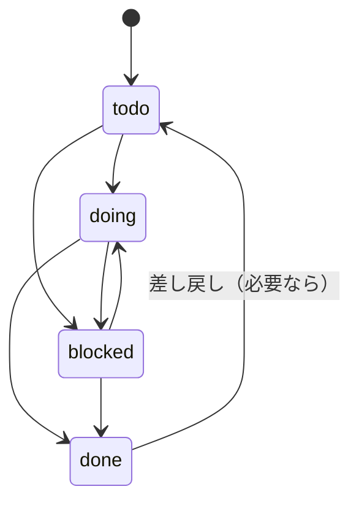
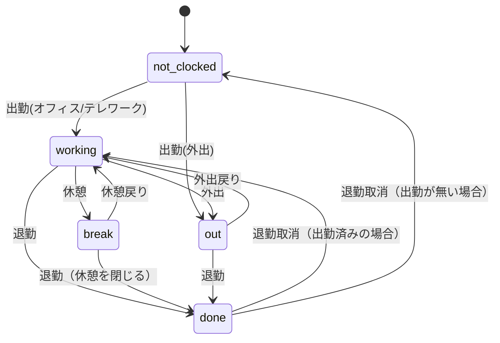

# PJバインダー マニュアル（使用者向け）

この文書は、日常的にPJバインダーを使う人向けに「効率よく運用するための使い方」をまとめます。

## 1. ダッシュボード（タスク管理）

### 1.1 画面構成
- 上：フィルタ（キーワード/プロジェクト/担当/期限/優先度/ステータス）
- 中：タスク表示（タブで切替）
  - タスク一覧 / カンバン / ガント
- 下：プロジェクト一覧（未/完了数など）

### 1.2 フィルタの使い方（作業効率が上がる）
- 「プロジェクト」で絞る → 最重要
- 「担当」で絞る → 自分のタスクだけにできる
- 「期限From/To」で今週だけなど
- 「ステータス」で `完了以外` を使うと便利

### 1.3 タスク一覧（list）
- 行の操作で編集・Docs・添付などを実行
- メモは一覧上で編集できる（セル内で保存/キャンセル）

### 1.4 カンバン（board）
- カードをドラッグ&ドロップで列移動（todo/doing/blocked/done）
- カード下部のボタンでもステータス変更できる

#### 担当者別スイムレーン
- 「担当者別スイムレーン」ON
- レーンにカードを落とすと、ステータスに加えて担当者（assignees）も更新される
  - `未割当` レーンに落とすと担当者がクリアされる

### 1.5 ガント（gantt）
- 「表示範囲（開始?終了）」を指定して「適用」
- スケール（日/週/月）で横幅が変わる
- 横スクロールはガント枠の中で行う（ページ全体は横スクロールしない）

## 2. プロジェクト

### 2.1 親子関係
- 親プロジェクトを指定すると、プロジェクトの階層管理ができる

### 2.2 期間・予算
- 期間はガント・管理の前提にする
- 予算はプロジェクトレベルで管理（必要な場合のみ）

### 2.3 プロジェクト完全削除（運用注意）
- 「完全削除」は関連タスク・添付も含めて削除する
- 実行前に、本当に不要か確認（復元は基本できない）

## 3. Docs（Googleドキュメント）連携

PJバインダーは、記録の残る業務をDocsに集約しやすい構成です。

- プロジェクトDocs：プロジェクトの基礎情報
- タスクDocs：タスクの情報（テンプレートから自動作成される場合あり）
- 議事録Docs：会議記録
- 日報Docs：日々の記録

### 3.1 よくある運用
- 「タスク作成 → Task Docs作成 → 実行メモはDocsに追記」
- 「議事録を作り、リンク共有権限を設定して関係者へ共有」

## 4. 添付（Attachment）
- タスク/プロジェクトに添付を紐づけられる
- カンバン上では?バッジで件数が見える

## 5. 議事録（Minutes）
- 登録時にDocs自動作成ができる
- 参加者/議題/決定事項など、会議情報の記録に使う

## 6. 日報（Daily）
- 日々の報告を残す
- Docs自動作成（または既存Docsへの追記/置換）を運用に合わせて使う

## 7. 勤怠

### 7.1 ダッシュボード
- ユーザーカードは freee従業員番号順で並ぶ
- 予定表示：個人カレンダー(ICS)から「現在の予定/次の予定」を表示

### 7.2 打刻の挙動
- 休憩/外出はトグル（押すと「戻り」表示になり、再度押すと復帰）
- 退勤もトグル（退勤後は「退勤取消」になり、押すと取り消し）

### 7.3 自動更新
- 勤怠ダッシュボードでのみ有効
- ページ移動・サマリ切替・タブ非表示で自動停止（不要な通信を減らす）

### 7.4 サマリ（月/週）と freee CSV
- 「月次読み込み」で月次データを取得
- 「freee集計CSVダウンロード」でCSVを出力
  - `users.employeeNumber` が未設定だと困るので必ず入力

## 8. ユーザー
- 勤怠表示・freee従業員番号・ICS URL を管理

## 9. 金庫（Vault）
- 認証情報を保存する（クライアント側暗号化前提の設計）
- 共有するときは運用ルール（パスフレーズ管理）を明確に

---

## 付録：タスク運用の状態遷移（Mermaid）

## 付録：勤怠の状態遷移（Mermaid）

