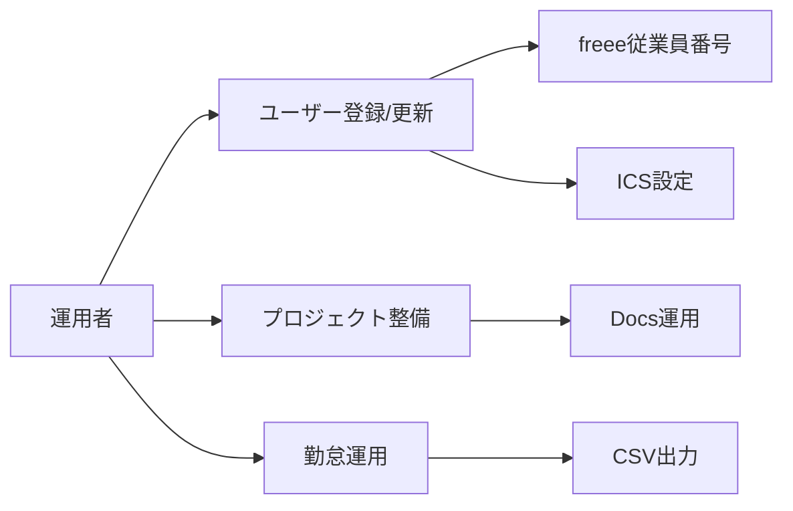

# PJバインダー ユーザーガイド（運用者向け）

この文書は「運用担当/管理者」が、日常運用・登録・メンテを迷わずできることを目的にしています。

## 1. 全体像

PJバインダーは大きく分けて次を扱います。

- タスク（一覧/カンバン/ガント）
- プロジェクト（親子・期間・予算・メモ・Docs）
- 勤怠（打刻・休憩/外出・予定・CSV）
- 議事録/日報（Docs自動作成）
- 予算/サブスク/入出金（管理用）

## 2. ロールと前提

- 利用者（一般）：タスク更新・勤怠打刻・資料閲覧
- 運用者：ユーザー設定、ICS設定の案内、プロジェクト整理、必要に応じてデータ整備

## 3. ユーザー管理

### 3.1 freee従業員番号
- 勤怠CSV（freee向け集計）の並び順・識別に使用します
- 未設定でも打刻は動きますが、CSV運用をする場合は必須です

### 3.2 勤怠に表示
- ON：勤怠ダッシュボードにカードを表示
- OFF：勤怠画面から除外（退職者/外部など）

### 3.3 ICS（予定の表示）
- 各ユーザーのGoogleカレンダーなどのICSを登録すると、勤怠ダッシュボードに予定が表示されます
- 予定の表示が必要ない場合は未設定でも問題ありません

#### ICS設定（Googleカレンダー）
1. Googleカレンダー → 対象カレンダー → 設定と共有
2. **予定のアクセス権限**
  - 一般公開して誰でも利用できるようにする
  - 予定の表示（すべての予定の詳細）
3. **カレンダーの統合** → 公開URL をコピー
4. PJバインダーのユーザー編集で ICS に貼り付け

注意：公開設定を伴います。組織のポリシーに沿って運用してください。

## 4. タスク運用

### 4.1 ステータス運用ルール例
- todo：未着手
- doing：進行中
- blocked：待ち/保留（レビュー待ち、相手待ち等）
- done：完了

### 4.2 一覧/カンバン/ガントの役割分担
- 一覧：検索/一括確認、担当や期限の棚卸し
- カンバン：今の作業状況の見える化（WIP管理）
- ガント：期間の見通し（開始/終了の調整）

### 4.3 カンバン運用の注意
- カンバンの列移動は状態変更に直結します
- ルールを決めておくと混乱が減ります（例：blockedの定義）

## 5. プロジェクト運用

### 5.1 親子プロジェクト
- 大きな案件を親にし、サブ案件を子にする運用が可能です
- 期間・予算は親/子それぞれに設定できます

### 5.2 Docs運用
- プロジェクト/タスク/議事録/日報からDocsを作成してリンクできます
- Docs作成は「ベストエフォート」扱い（失敗しても保存処理は継続）

## 6. 勤怠運用

### 6.1 勤怠カードの並び
- freee従業員番号の昇順で表示されます

### 6.2 打刻の挙動（重要）
- 退勤後に出勤を押すと「退勤取消」として扱い、退勤時刻がクリアされます
- 退勤ボタンは「退勤/退勤取消」のトグルです
- 休憩/外出は「開始」を押すと「戻り」が表示されます

### 6.3 CSV（freee向け集計）
- 出力は勤怠サマリから行います
- 入力ミスがある場合は、まず当日の打刻状態を確認して補正してください

---

## 付録：運用フロー（Mermaid）

